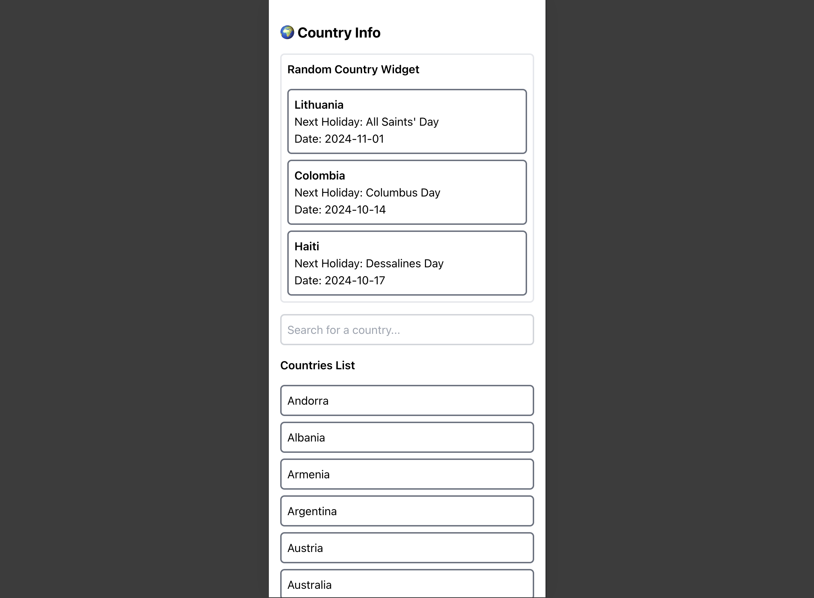

# Country Info App

live page: https://country-info-assignment.vercel.app

## Run project

Install dependecies:

```
npm install
```

Run locally in development mode:

```
npm run dev
```

Build the application for production usage:

```
npm run build
```

The result will be in a `dist/` folder which needs to be served by static files web server e.g. [nginx](https://nginx.org/).


## App functionality:


When you open the client app, the main page will be displayed:

The interface is responsive to different screen sizes:



### 1. Country Search
- Users can search for countries by name. The application displays a list of countries that match the search query.

- Each country name is clickable, allowing users to navigate to the country details page.

### 2. Random Countries Widget
- The application displays 3 random countries and their next holiday.
- Shows the country name, holiday name, and holiday date.
- Each country is clickable, allowing users to navigate to the country details page.

### 3. Country Holidays Details
- Users can view the list of holidays for a selected country by year.

- Default view shows holidays for the current year, with options to switch to other years (2020 to 2030).

- Displays holiday name, date, and type (public or private).

## Technologies Used
- **Vue.js**: Frontend framework for building user interfaces.
- **Vue Router**: The official router for Vue.js, enabling navigation between views.
- **TypeScript**: Superset of JavaScript for static type checking.
- **Tailwind CSS**: Utility-first CSS framework for styling.
- **Axios**: Promise-based HTTP client for making API requests.
- **Nager.Date API**: Source for holiday data.
